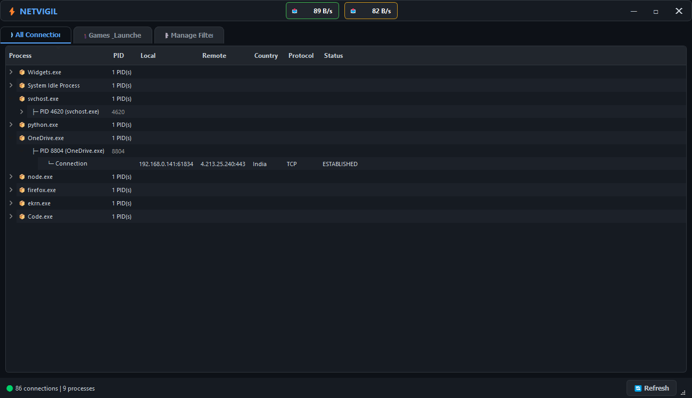

# ⚡ NetVigil — Network Monitor with Game Filtering

A modern, dark-themed network monitor for Windows that shows active connections grouped by process.  
Features a dedicated **Games & Launchers** tab with customizable filters, real-time country lookup, and a sleek custom title bar.

 <!-- Add a screenshot later -->

## ✨ Features

- **All Connections** tab – View every active TCP/UDP connection, grouped by process.
- **Games & Launchers** tab – Show only connections from games and launchers (Steam, Epic, Riot, etc.).
- **Filter Management** – Easily add/remove process names to the filter list; saved automatically.
- **Country Lookup** – Resolves remote IPs to countries using multiple free APIs (works inside Iran).
- **Live Speed Monitor** – Real-time download/upload speed in the title bar.
- **Custom Dark UI** – Frameless window with custom title bar, modern color palette, and smooth styling.
- **Run as Administrator** – Built-in manifest requests elevated privileges for full connection visibility.

## 📸 Screenshot

*(Add a screenshot of your app here to make the README attractive)*

## 📋 Requirements

- Windows 10/11 (tested)
- Python 3.7+ 
- Administrator privileges (to see all connections)

## 🚀 Installation & Usage

### Run from source

1. Clone the repository:

```bash
git clone https://github.com/ZvanTors/NetVigil.git
cd NetVigil
```

2. Install dependencies:

```bash
pip install -r requirements.txt
```
If you don't have requirements.txt, simply install:

```bash
pip install psutil requests PyQt5
```

3. Run the application:

```bash
python netvigil.py
```

### Build standalone EXE

```bash
pip install pyinstaller
pyinstaller --onefile --windowed --uac-admin --name "NetVigil" netvigil.py
```

The EXE will be in the dist folder.

### 🎮 Filter Customization

By default, the app includes a set of common game/launcher process names.
To customize:

    Run the app once; a game_filters.txt file is created automatically.

    Edit this file with one process name per line (case-insensitive).

    Use the Manage Filters tab in the app to add/remove entries interactively.

Note: If game_filters.txt is missing, the app recreates it with the default list.

### 🌍 Country Lookup

NetVigil uses these free geolocation services (tried in order):

    ip-api.com (works over HTTP, unfiltered in Iran)

    ipwho.is

    freeipapi.com

No API keys are needed.

### ⚠️ Important

On first run, Windows SmartScreen may warn about the unsigned EXE. Click “More info” → “Run anyway”.

Some antivirus software may false-flag PyInstaller‑packaged programs. Add an exception if needed.

Without Administrator rights, only connections from your own user processes are shown.

### 🛠️ Built With

Python – Core logic

PyQt5 – Graphical interface

psutil – Network connection enumeration

Requests – IP geolocation

Made with ❤️ for gamers and network curious!